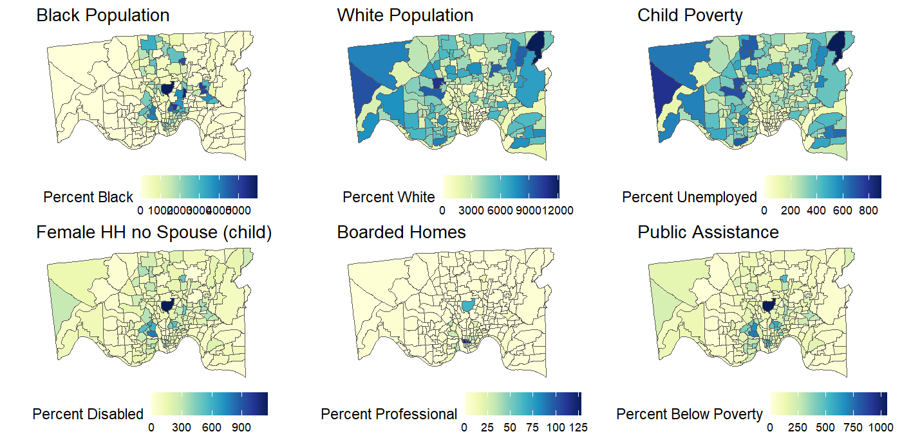

# Social Geography of Historic Data for Structural Mitigation
The code in this repository demonstrates how to automatically download and wrangle historic NHGIS data for analysis and mapping. 

The code documents a complete R-based workflow for accessing, processing, and visualizing 1990 decennial census data from NHGIS. The goal is to reconstruct neighborhood-level social and economic conditions relevant to structural mitigation, legal advocacy, and environmental justice.

## Purpose

The project provides a replicable approach to identifying historic patterns of structural disadvantage, including poverty, racial segregation, housing vacancy, and disinvestment. These data are used to contextualize present-day disparities and support justice-centered interventions.

## Data Sources

**Note:** You will need to acquire an API key, and you need to have a free account at [IPUMS](https://uma.pop.umn.edu/).

This workflow draws on:

- **NHGIS 1990 STF1 and STF3 datasets**: Summary files with tract-level data on household composition, race/ethnicity, education, income, and housing.
- **TIGER/Line shapefiles**: Road networks and tract boundaries for Hamilton County, Ohio.
- **Custom cleaned shapefiles**: 1990 census tracts matched to NHGIS GISJOINs.

## Required R Packages

- `ipumsr`
- `dplyr`
- `ggplot2`
- `stringr`
- `sf`
- `purrr`
- `tidyr`
- `gridExtra`
- `RColorBrewer`
- `cmocean`
- `grid`
- `tigris`
- `scales`

## Workflow Steps

### 1. NHGIS Data Access and Extraction

- Set the IPUMS API key using `set_ipums_api_key()`
- Retrieve and filter available datasets using `get_metadata_nhgis()`
- Select 1990 STF1 tables related to households, race, family structure, and housing
- Select 1990 STF3 tables related to education, poverty, income, and public assistance
- Use `define_extract_nhgis()` to request tract-level data
- Submit and download extracts via the IPUMS API
- Read and load the data using `read_nhgis()`

### 2. Data Cleaning and Selection

- Filter for Ohio, specifically Hamilton County
- Rename variables for interpretability (e.g., `E33003` to `HS`)
- Select key indicators:
  - Race (White, Black, AIAN, Asian, Other)
  - Group quarters and family composition
  - Educational attainment overall and for Black residents
  - Public assistance and income-to-housing ratios
  - Full income bracket distributions
  - Age-specific poverty status (above/below poverty by age)
  - Income-to-poverty ratio ranges

### 3. Data Merging and Spatial Join

- Merge STF1 and STF3 extracts by `GISJOIN`
- Load 1990 tract shapefile and join with the merged NHGIS data
- Load TIGER road network shapefile for Hamilton County and convert to `sf`

### 4. Visualization

Maps are created using `ggplot2::geom_sf()` with tract polygons colored by variable values. Variables mapped include:

- Black population 
- White population 
- Poverty 
- Public Assistance 
- Vacant and Boarded Housing
- Percent Below Poverty Line
- Percent Vacant Housing
- Female Headed Households with children (No spouse!)

Maps are arranged in grid layouts using `gridExtra::grid.arrange()`. Median home values are scaled and labeled in thousands using `scales::label_number()`.

### 5. Example Map Output

The final output is a grid of eight maps titled:

**"Neighborhood Social and Economic Conditions (1990)"**

These maps provide a visual summary of historical neighborhood characteristics and are intended to support analyses of structural context in present-day health, legal, or policy studies.

## Applications

This workflow supports:

- Structural mitigation in death penalty and juvenile sentencing cases
- Historical redlining and disinvestment analysis
- Environmental (in)justice and social vulnerability
- Neighborhood change studies
- Racial disparities of health

## Notes and Customization

- Replace `"Ohio"` and `"Hamilton"` with your region of interest to apply the workflow elsewhere.
- Input shapefiles must be projected and pre-cleaned to match NHGIS tract identifiers.
- Data for 1990 may contain suppressed or imputed values; always verify variable reliability.

## Citation

If you use or adapt this workflow, please cite the data source:

> IPUMS NHGIS, University of Minnesota. https://www.nhgis.org

## License

This repository is shared under a [Creative Commons BY-NC-SA 4.0 License](https://creativecommons.org/licenses/by-nc-sa/4.0/).

---

For questions or contributions, open an issue or contact the maintainer.
